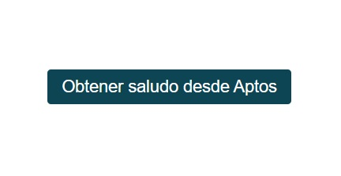

# Introducción

## Preparando el entorno de desarrollo

### Aptos CLI

Mientras que no vamos a interactuar ni modificar código Move directamente, si vamos a interactuar con la Blockchain de Aptos, por lo que es necesario tener instalada la Aptos CLI. Las instrucciones detalladas para esta instalación están en el [repositorio principal](https://github.com/Zona-Tres/aptos-first-steps/).

Asegúrate de instalarla en el sistema operativo que estés utilizando. Puedes probar que todo salió bien corriendo en una terminal:

```sh
aptos --version
```

> :information_source: Recuerda instalar algún editor de código cómo [VSCode](https://code.visualstudio.com/).

### nvm

Dado a que trabajaremos con frontend, utilizaremos el **SDK de Aptos de TypeScript**. Para ello, es necesario tener instalada una manera de interactuar con JavaScript. Usualmente para pruebas pequeñas, la consola del navegador suele ser suficiente, sin embargo, para seguir el curso te recomendamos instalar **Node JS**.

Hay distintas formas de lograr esto, la más fácil en nuestra opinión es utilizar **[nvm](https://github.com/nvm-sh/nvm)**. `NVM` (**N**ode **V**ersion **M**anager) es, como su nombre lo indica, un administrador de versiones de Node. Se utiliza para instalar y administrar las versiones de Node, así como para cambiar la versión con la que estás trabajando.

Puedes encontrar las instrucciones de instalación en su repositorio oficial (enlazado arriba), o simplemente seguir las siguientes instrucciones dependiendo de tu sistema operativo:

#### Windows

Para Windows, tenemos **[nvm-windows](https://github.com/coreybutler/nvm-windows)**

Puedes ir a su página de [releases](https://github.com/coreybutler/nvm-windows/releases) y descargar el ejecutable (.exe) de la última versión.

O simplemente haz clic **[aquí](https://github.com/coreybutler/nvm-windows/releases/download/1.1.12/nvm-setup.exe)**.

Una vez completada la instalación puedes confirmar que todo esté correcto corriendo el siguiente comando en una terminal:

```sh
nvm -v
```
> :information_source: Si no tienes una terminal preferida instalada en Windows, te recomendamos utilizar PowerShell para seguir estos tutoriales. PowerShell viene por defecto instalada en Windows. NO utilices `cmd`.

### Linux y Mac

Ya sea que tengas instalado `curl` o `wget` puedes correr alguno de estos dos comandos:

```sh
curl -o- https://raw.githubusercontent.com/nvm-sh/nvm/v0.40.1/install.sh | bash
```
```sh
wget -qO- https://raw.githubusercontent.com/nvm-sh/nvm/v0.40.1/install.sh | bash
```

Al terminar la instalación **cierra tu terminal** y vuelve a abrirla. Después, corre el siguiente comando para validar que todo esté correcto:

```sh
nvm -v
```

### Node JS y `npm`

Una vez instalado `nvm`, podemos finalmente instalar Node JS. Para hacerlo, simplemente ejecuta el siguiente comando:

```sh
nvm install latest
```

Esto instalará la versión más reciente de Node JS y `npm`. Al finalizar, **cierra tu terminal** y vuelve a abrirla. Después, corre los siguientes comandos para validar que todo esté correcto:

```sh
node -v
```
```sh
npm -v
```

Node será la herramienta que nos permitirá compilar JavaScript sin necesidad de un navegador, mientras que con `npm` podemos instalar los paquetes necesarios para el desarrollo de aplicaciones, entre ellas, el kit de desarrollo de software, o SDK de Typescript servirá para interactuar con la Blockchain de Aptos.

## Corriendo el ejemplo

Dentro del directorio `src` encontraremos el arcivo con el código relevante del proyecto. Los demás archivos por lo general contienen configuraciones necesarias para que el proyecto funcione.

Para ejecutar el proyecto, necesitamos 2 comandos:

* El primer comando instala las dependencias necesarias para que el proyecto funcione. Dado a que nuestro proyecto es una app web, necesitamos descargar todas las librerías que se requieren. Por lo general, siempre que corramos uno de estos ejemplos necesitaremos correr este comando primero:
    ```sh
    npm install
    ```
* El segundo comando comenzará un servidor de desarrollo en nuestra computadora y servirá nuestra aplicación:
    ```sh
    npm run dev
    ```

Después de unos momentos obtendrás algo como esto:
```
  VITE v5.4.9  ready in 102 ms

  ➜  Local:   http://localhost:5173/
  ➜  Network: use --host to expose
  ➜  press h + enter to show help
```

Esto nos indica que nuestro servidor se configuró correctamente y que nuestra app está corriendo en el link que aparece en `Local`. Para navegar a ese link puedes copiarlo y pegarlo en un navegador, o simplemente presionar la tecla `Ctrl` en tu teclado y hacer click en el enlace. De cualquier manera que lo hagas obtendrás en tu navegador algo como esto:



Por último, haz click en el botón verde.

¡Felicidades! :partying_face: Acabas de interactuar con la blockchain de Aptos utilizando el TypeScript SDK.

## Replicando este proyecto

Si quieres replicar esta pequeña aplicación puedes usar el comando:
```sh
npm create vite@latest
```

Vite es una herramienta de desarrollo rápida y ligera que facilita la creación y configuración de aplicaciones web modernas. Diseñada para aprovechar las características más recientes de JavaScript, Vite proporciona un entorno de desarrollo sumamente rápido mediante el uso de módulos de ES nativos para cargar y compilar archivos de manera eficiente. Esto reduce significativamente los tiempos de inicio del proyecto y permite una experiencia de desarrollo más fluida en comparación con otros empaquetadores tradicionales.

Durante todo el curso estaremos usando esta herramienta de fondo. Sin embargo, no tienes que preocuparte por configurarla o incluso entenderla, dado a que cada app ya tiene todas las configuraciones necesarias para funcionar.