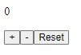

# React

## Introducción

Aunque este curso no se centra en enseñar específicamente librerías de frontend, exploraremos conceptos fundamentales de React y algunas de sus herramientas complementarias.

React es una popular biblioteca de JavaScript utilizada para construir interfaces de usuario interactivas y dinámicas. Su enfoque en la creación de componentes reutilizables y su eficiente manejo del DOM hacen que sea esencial en el desarrollo frontend moderno, permitiendo a los desarrolladores crear aplicaciones web escalables y mantenibles.

### Documentación

La mayoría de conceptos necesarios para el curso serán explicados durante los tutoriales. De igual manera te dejamos algunos recursos para aprender por tu cuenta en caso de que quieras adentrarte más al mundo de **React**:

* [Inicio rápido | React | Quick start oficial en español](https://es.react.dev/learn)
* [Aprende desarrollo web | MDN | Primeros pasos en la documentación oficial de Mozilla](https://developer.mozilla.org/es/docs/Learn/Tools_and_testing/Client-side_JavaScript_frameworks/React_getting_started)

### Vite

Como comentamos en la lección pasada, estaremos utilizando Vite para correr nuestros ejemplos.

Vite es una herramienta de desarrollo rápida y ligera que facilita la creación y configuración de aplicaciones web modernas. Diseñada para aprovechar las características más recientes de JavaScript, Vite proporciona un entorno de desarrollo sumamente rápido mediante el uso de módulos de ES nativos para cargar y compilar archivos de manera eficiente. Esto reduce significativamente los tiempos de inicio del proyecto y permite una experiencia de desarrollo más fluida en comparación con otros empaquetadores tradicionales.

De igual manera te dejamos algunos recursos en caso de que quieras conocer más sobre **Vite**:

* [Introducción | vite_js | Documentación oficial de Vite](https://es.vitejs.dev/guide/)
* [create-vite | npm | Paquete con el que se crearon los proyectos del curso](https://www.npmjs.com/package/create-vite)

## Ejecutando el tutorial

> :information_source: Recuerda que debes navegar en tu terminal a este directorio:
>```sh
>cd frontend/01_react
>```

Para ejecutar el proyecto corre los siguientes comandos en tu terminal:

* Instala las dependencias del proyecto
    ```sh
    npm install
    ```
* Levanta el servidor de desarrollo
    ```sh
    npm run dev
    ```

Después de unos momentos obtendrás algo como esto:
```
  VITE v5.4.9  ready in 102 ms

  ➜  Local:   http://localhost:5173/
  ➜  Network: use --host to expose
  ➜  press h + enter to show help
```

Navega al enlace `http://localhost:5173/` en tu navegador ó simplemente presiona `Ctrl`+`click` en el enlace que se muestra en la terminal.

Al abrir la aplicación deberías de ver algo como esto:



## Tutorial

Esta pequeña aplicación nos ayudará a entender lo básico sobre cómo funciona React. La app es un **contador**.

Si haces click en `+`, el contador aumentará. De manera inversa, si haces click en el botón con el signo `-`, el valor del contador será decrementado. Por último, el botón `Reset` reestablece el contador, poniendo su valor en `0`.

### Estructura de una App en React

Antes de que leas el código para averiguar cómo funciona, es importante ver la estructura de una App en React. Los archivos en el proyecto deberían verse algo así:

```
01_react
├─┬─ src/
│ ├─── App.jsx
│ └─── main.jsx
├─── index.html
├─── package.json
├─── package-lock.json
├─── vite.config.js
└─── README.md
```

Vamos a explicar cada uno de ellos, comenzando por los menos relevantes para el tutorial.

* [README.md](./README.md)
    * Este es el archivo que estás leyendo en este momento. Usualmente contiene toda la documentación sobre el proyecto y otra información relevante que los desarrolladores deseen agregar.
* [vite.config.js](./vite.config.js)
    * Configuraciones iniciales de **Vite**. Estos archivos no los estaremos modificando nunca, pero son esenciales para el funcionamiento del proyecto.
* [package.json](./package.json)
    * Contiene la lista de dependencias del proyecto, es decir, las librerías con las que nuestro proyecto funciona. Además, contiene información general del proyecto. Al correr el comando `npm install`, `npm` lee este archivo para saber que archivos debe de descargar de internet.
* [package-lock.json](./package-lock.json)
    * Si `package.json` contiene la lista de librerías del proyecto, `package-lock.json` contiene información sobre las librerías que las librerías del proyecto necesitan. Esto asegura que si alguien más quiere correr este proyecto en una computadora diferente a la que se creó inicialmente, todas las librerías y dependencias de proyecto estarán en las mismas versiones. Esto nos ayuda a que cualquier persona ejecutando este proyecto va a obtener el mismo resultado que el creador del mismo.
    * Nunca vamos a modificar este archivo, dado a que es generado y actualizado automáticamente por `npm` al correr `npm install`.
* [index.html](./index.html)
    * Dado a que estamos corriendo una app web, necesitamos un archivo HTML para que el navegador lo lea. React agrega el resto de la aplicación en formato HTML por nosotros al momento de construir la app, por lo que nosotros nunca modificaremos directamente este archivo.
* [main.jsx](./src/main.jsx)
    * Punto de entrada de nuestra aplicación completa. Por ahora este archivo no es tan relevante para nosotros, dado a que estaremos modificando un archivo que se está importando aquí: `App.jsx`.
* [App.jsx](./src/)
    * Código de nuestra aplicación. La mayor parte de las explicaciones siempre estarán en este archivo.

El archivo `App.jsx` contiene todo el código con comentarios sobre qué hace cada cosa, te recomendamos leerlo detenidamente para entender los contenidos de cada lección, así como que se necesita para que funcione.

## Reto

Simplemente lee la documentación y asegúrate de entenderla. Durante todos los tutoriales vamos a estar trabajando con React.