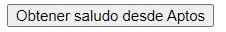
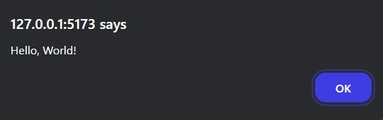

# Aptos TS SDK

Un SDK (Software Development Kit, por sus siglas en inglés) es un conjunto de herramientas, bibliotecas, documentación y ejemplos de código que los desarrolladores utilizan para crear aplicaciones y software específicos para una plataforma o entorno particular. Los SDKs facilitan el desarrollo al proporcionar componentes preconstruidos y utilidades que agilizan la integración de funciones complejas, como autenticación, gráficos o servicios en la nube, permitiendo a los desarrolladores centrarse en la lógica y características únicas de sus aplicaciones.

En Aptos, utilizamos SDKs para simplificar la interacción de una aplicación con la blockchain.

## Ejecutando el tutorial

> :information_source: Recuerda que debes navegar en tu terminal a este directorio:
>```sh
>cd frontend/02_aptos_ts_sdk
>```

Para ejecutar el proyecto corre los siguientes comandos en tu terminal:

* Instala las dependencias del proyecto
    ```sh
    npm install
    ```
* Levanta el servidor de desarrollo
    ```sh
    npm run dev
    ```

Después de unos momentos obtendrás algo como esto:
```
  VITE v5.4.9  ready in 102 ms

  ➜  Local:   http://localhost:5173/
  ➜  Network: use --host to expose
  ➜  press h + enter to show help
```

Navega al enlace `http://localhost:5173/` en tu navegador ó simplemente presiona `Ctrl`+`click` en el enlace que se muestra en la terminal.

Al abrir la aplicación deberías de ver algo como esto:



Al hacer click en el botón, obtendrás algo como esto:



## Tutorial

Puedes encontrar la documentación para este tutorial dentro del archivo `src/App.jsx`. Cada una de las declaraciones tiene un comentario para ayudarte a entender cada uno de los temas tocados.

### Redes

La blockchain de Aptos está separada en 3 redes principales:
* devnet
* testnet
* mainnet

Puedes pensar en cada red como su propia blockchain de Aptos que tiene usos diferentes. La red `devnet` se utiliza, como su nombre lo indica, para desarrollo de aplicaciones. Esta es una de las redes en la que nos vamos a estar enfocando. La red `devnet` tiene la particularidad de que es reestablecida cada semana. Los tokens utilizados en esta red no tienen ningún valor real.

La red `testnet` es la red de pruebas. Esta red principalmente se utiliza para desplegar aplicaciones y evaluar su funcionamiento antes de pasarlas a la red principal o `mainnet`. Al igual que la `devnet`, los tokens utilizados en `testnet` no tienen valor real.

Por último, `mainnet` es la red real y la red principal. Es donde vive el token `APT`, y estos tokens tienen valor real. La meta es que logremos desplegar una aplicación en `mainnet`.

|Description|Mainnet|Testnet|Devnet|
|---|---|---|---|
|Node REST API|[Link](https://api.mainnet.aptoslabs.com/v1)|[Link](https://api.testnet.aptoslabs.com/v1)|[Link](https://api.devnet.aptoslabs.com/v1)|
|GRPC Transaction Stream|[Link](https://grpc.mainnet.aptoslabs.com)|[Link](https://grpc.testnet.aptoslabs.com)|[Link](https://grpc.devnet.aptoslabs.com)|
|Faucet|Sin Faucet|[Link](https://faucet.testnet.aptoslabs.com/)|[Link](https://faucet.devnet.aptoslabs.com/)|
|Génesis|[Link](https://github.com/aptos-labs/aptos-networks/tree/main/mainnet)|[Link](https://github.com/aptos-labs/aptos-networks/tree/main/testnet)|[Link](https://github.com/aptos-labs/aptos-networks/tree/main/devnet)|
|Duración de Epoch|7200 segundos|7200 segundos|7200 segundos|
|Proveedores de Red|Completamente descentralizada.|Administrada por Aptos Labs en nombre de la Aptos Foundation.|Completamente descentralizada.|Administrada por Aptos Labs en nombre de la Aptos Foundation.|
|Frequencia de lanzamiento|Mensual|Mensual|Semanal|
|Frecuencia de borrado|Nunca|Nunca|Cada que se actualiza (semanal)|
|Propósto|La red principal de Aptos.|Red de pruebas longeva.|Para exploración y experimentación.|
|Estado de la red|Siempre arriba|Siempre arriba|Casi siempre arriba, con breves interrupciones cada que hay una actualización.|

## Reto

Simplemente lee la documentación y asegúrate de entenderla. Durante la mayor parte del repositorio vamos a estar trabajando con el Aptos TS SDK.