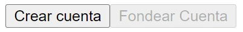
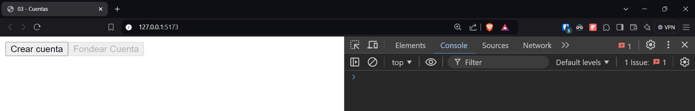
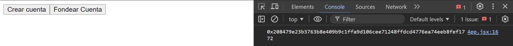

# Cuentas

Una cuenta en la blockchain de Aptos representa el control de acceso a un conjunto de activos, que incluyen tokens y NFT. En Aptos, estos activos se representan mediante una primitiva del lenguaje Move, conocida como **recurso**, que enfatiza el control de acceso y la escasez.

Cada cuenta se identifica mediante una dirección de cuenta de 32 bytes.

Ejemplo:
```
0x0b3be25c1755bcef81b6bb39bf26e522e9507db7a2b1c1b7f8bbb59264590f97
```

## Ejecutando el tutorial

> :information_source: Recuerda que debes navegar en tu terminal a este directorio:
>```sh
>cd frontend/03_cuentas
>```

Para ejecutar el proyecto corre los siguientes comandos en tu terminal:

* Instala las dependencias del proyecto
    ```sh
    npm install
    ```
* Levanta el servidor de desarrollo
    ```sh
    npm run dev
    ```

Después de unos momentos obtendrás algo como esto:
```
  VITE v5.4.9  ready in 102 ms

  ➜  Local:   http://localhost:5173/
  ➜  Network: use --host to expose
  ➜  press h + enter to show help
```

Navega al enlace `http://localhost:5173/` en tu navegador ó simplemente presiona `Ctrl`+`click` en el enlace que se muestra en la terminal.

Al abrir la aplicación deberías de ver algo como esto:



La aplicación tiene 3 botones, pero por el momento sólo podemos ver 2 de ellos. Y sólo uno está habilitado.

Haz click en `Crear cuenta` para crear una cuenta en Aptos. La información de la cuenta aparecerá en la consola.

Para abrir la consola en tu navegador, simplemente presiona `F12` en tu teclado y después haz click en la pestaña `Consola` ó `Terminal`. También puedes probar con el comando `Ctrl`+`Shift`+`J`. Deberías de ver tu navegador de manera similar a esta:



> :information_source: Puedes ajustar la posición de las Herramientas de Desarrollador haciendo click en los 3 puntos en la esquina superior derecha.

Durante todos los siguientes tutoriales estaremos usando la consola.

Una vez que hayas hecho click en `Crear cuenta` deberías de ver algo similar a esto: 



> :information_source: La cuenta que obtengas será diferente a la de la imagen.

Esta cadena alfanumérica que ves en la consola es una cuenta en Aptos. Pero esta cuenta aún no existe dentro de la red de Aptos. Para convertirla en una cuenta oficial hay que fondearla, es decir, transferir fondos a ella.

Por suerte, estamos trabajando en una red de pruebas (`testnet`), por lo que los tokens aquí no son de verdad. Así que podemos fondear la cuenta con una simple función.

Ahora que hemos creado la cuenta, se ha habilitado el siguiente botón: `Fondear cuenta`. Haz click en este botón para agregar tokens `APT` a la cuenta.

> :information_source: Es posible que veas algunos errores en la consola. Puedes ignorarlos, es simplemente un error dado a que la transacción no se ha subido al indexador desde donde el Aptos TS SDK obtiene la información. Básicamente esto es porque las transacciones se están ejecutando demasiado rápido. En la siguiente lección explicaremos más a fondo esto.

Después de esto, el siguiente botón debería de aparecer: `Consultar saldo`. Al hacer click en este último botón deberías de ver un mensaje como este en la consola:

```
El saldo de Alicia es: 100
```

Ahora esta cuenta es oficial y está en la red de Aptos. Puedes ver información sobre la cuenta que acabas de crear haciendo click en el link que apareció al fondear la cuenta `Información de la cuenta en el Aptos Explorer`. O buscarla manualmente visitando el [Aptos Explorer](https://explorer.aptoslabs.com/).

## Tutorial

Puedes encontrar la documentación para este tutorial dentro del archivo `src/App.jsx`. Cada una de las declaraciones tiene un comentario para ayudarte a entender cada uno de los temas tocados.

### Fondeo de una cuenta

A diferencia de otras blockchains en las que las cuentas y las direcciones son implícitas, las cuentas en Aptos son explícitas y deben crearse antes de poder ejecutar transacciones. La cuenta puede crearse explícita o implícitamente transfiriendole tokens de Aptos (`APT`). 

En cierto modo, esto es similar a otras blockchains en las que una dirección necesita que se le envíen fondos para gas antes de que pueda enviar transacciones.

Las cuentas explícitas permiten características de primera clase que no están disponibles en otras redes, tales como:

* **Clave de autenticación rotatoria**: La clave de autenticación de la cuenta puede cambiarse para ser controlada a través de una clave privada diferente. Esto es similar al cambio de contraseñas en el mundo web2.
* **Soporte nativo multisig**: Las cuentas en Aptos soportan k-de-n multisig usando ambos esquemas de firma Ed25519 y Secp256k1 ECDSA cuando se construye la clave de autenticación.

Actualmente, Aptos sólo admite un único identificador unificado para una cuenta. Las cuentas en Aptos se representan universalmente como una cadena hexadecimal de 32 bytes. Una cadena hexadecimal más corta que 32-bytes es también válida; en esos escenarios, la cadena hexadecimal puede ser rellenada con ceros a la izquierda, por ejemplo, `0x1` => `0x0000000000000...01`. Mientras que los estándares de Aptos indican que los ceros a la izquierda pueden ser eliminados de una dirección, la mayoría de las aplicaciones intentan evitar ese comportamiento heredado y sólo soportan la eliminación de 0s para direcciones especiales que van de `0x0` a `0xa`.

### Creando una cuenta

Cuando un usuario solicita crear una cuenta, por ejemplo utilizando el SDK de Aptos, se ejecutan los siguientes pasos:
* Seleccionar el esquema de autenticación para gestionar la cuenta del usuario, por ejemplo, Ed25519 o Secp256k1 ECDSA.
* Generar un nuevo par de clave privada y clave pública.
* Combinar la clave pública con el esquema de autenticación de la clave pública para generar una clave de autenticación de 32 bytes y la dirección de la cuenta.

El usuario debe utilizar la clave privada para firmar las transacciones asociadas a esta cuenta.

## Reto

Alicia se siente sola. Crea una cuenta para acompañarla.