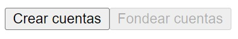

# Transacciones

Las transacciones permiten modificar los datos en la blockchain o desencadenar eventos. Por lo general, las transacciones siguen 5 pasos desde su creación hasta su ejecución:

* Construir la transacción.
* Simular el gasto. (Opcional)
* Firmar la transacción.
* Enviar la transacción a la red.
* Espera a que la blockchain se valide y actualice.

## Ejecutando el tutorial

> :information_source: Recuerda que debes navegar en tu terminal a este directorio:
>```sh
>cd frontend/04_transacciones
>```

Para ejecutar el proyecto corre los siguientes comandos en tu terminal:

* Instala las dependencias del proyecto
    ```sh
    npm install
    ```
* Levanta el servidor de desarrollo
    ```sh
    npm run dev
    ```

Después de unos momentos obtendrás algo como esto:
```
  VITE v5.4.9  ready in 102 ms

  ➜  Local:   http://localhost:5173/
  ➜  Network: use --host to expose
  ➜  press h + enter to show help
```

Navega al enlace `http://localhost:5173/` en tu navegador ó simplemente presiona `Ctrl`+`click` en el enlace que se muestra en la terminal.

Al abrir la aplicación deberías de ver algo como esto:



Esta actividad es muy similar a la anterior, sólo que esta vez trabajaremos con 2 cuentas.

* Haz click en el botón `Crear cuentas` para generar cuentas usando el objeto Account. Deberías de obtener en la consola algo similar a esto:
    ```
    0x2798153ade66b2e82b74470251ef3cea029ecbb54278109db45233888ba23764
    0xc19538404da1e5ee4f38fe512494edd07672fc9ffa7bf58f99f589cbab9e2a14
    ```
    > :information_source: Las cuentas que se te generen a tí serán diferentes a estas.
* Haz click en el botón `Fondear cuentas`. La terminal debería de mostrar algunos errores y el siguiente mensaje:
    ```
    El saldo inicial de Alicia es: 100000000
    El saldo inicial de Bob es: 100
    ```
* Haz click en el nuevo botón `Transferir de Alicia a Bob`. Esto hará una transferencia de `100` Octas  desde la cuenta de Alicia a la cuenta de Bob. Deberías de obtener algo similar a esto:
    ```
    Hash de la transacción:  0x7e701cf06c08ee3040a61338450a736998dfd60873a9cb167b3766331366d5ba
    ```
    > :information_source: El hash de la transacción que se te genere a tí será diferente a este.
* Por último, puedes consultar el saldo de ambas cuentas para validar que la transferencia fue correcta:
    ```
    El saldo de Alicia es: 99999000
    El saldo de Bob es: 200
    ```
* Puedes tambien validar ambas cuentas en el Aptos Explorer con los nuevos links generados.

## Tutorial

Puedes encontrar la documentación para este tutorial dentro del archivo `src/App.jsx`. Cada una de las declaraciones tiene un comentario para ayudarte a entender cada uno de los temas tocados.

A continuación te explicamos los pasos para crear una transacción.

### Construir

La creación de una transacción consiste en especificar:

* La cuenta del remitente.
    * Esta cuenta normalmente paga los gastos de gas de esta transacción. Consulte Patrocinio de transacciones para saber cómo hacer que otra cuenta pague las tasas.
* La función que se llama en la cadena.
    * Este es el identificador de la función de entrada del contrato inteligente en la blockchain que se activará cuando ejecute esta transacción.
* Los argumentos de la función.
    * Estos son los datos que la función necesita para ejecutarse.

### Opciones de construcción

Puedes personalizar la forma en que se ejecuta tu transacción pasando opciones al construir. Algunas de las opciones más utilizadas son:
* `maxGasAmount` - Esto limita la cantidad de gas que estás dispuesto a pagar para ejecutar esta transacción.
* `gasUnitPrice` - Puede especificar un precio por gas superior al mínimo para que la red Aptos lo ejecute con mayor prioridad.
* `expireTimestamp` - Esto da un tiempo concreto en el que la transacción debe ejecutarse o será cancelada.


El SDK proporciona valores por defecto sensibles para estos valores si no se especifican explícitamente.

### Simulación (Opcional)

Cada transacción en la cadena Aptos tiene una tarifa de gas asociada a la cantidad de trabajo que las máquinas de la red tienen que hacer al ejecutar la transacción. Para estimar el costo asociado, puedes simular transacciones antes de realizarlas.

### Firma

Una vez que la transacción está construida y las tasas parecen razonables, puedes firmar la transacción con `aptos.transaction.sign`. **La firma debe proceder de la cuenta del remitente**.


### Enviar

Ahora que la transacción está firmada, puede enviarla a la red utilizando `aptos.transaction.submit.simple`. En el tutorial juntamos este paso con el anterior usando `aptos.signAndSubmitTransaction`.

### Esperar

Por último, puedes esperar el resultado de la transacción utilizando `aptos.waitForTransaction` y especificando el hash de la transacción que acabas de enviar.

## Reto

Alicia no quiere compartir sus tokens con nadie. Regrésaselos transfiriendolos de vuelta desde la cuenta de Bob.