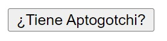
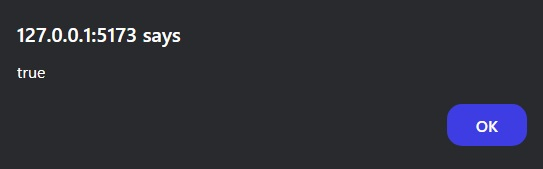
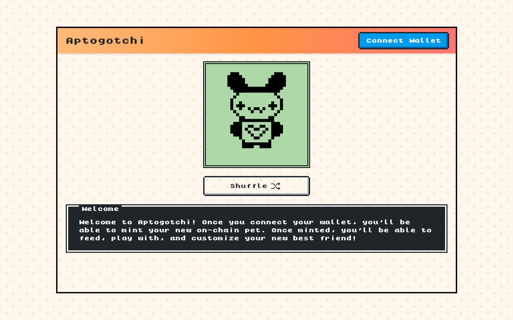

# Funciones de Lectura

Las funciones de vista o lectura permiten **consultar** contratos inteligentes en la blockchain de Aptos. Se definen en los contratos inteligentes como funciones de entrada con el modificador de vista `[#view]`.

Las funciones de lectura **no modifican información dentro de la blockchain**, por lo tanto no generan una transacción y no tienen que ser firmadas por nadie. Es decir, no hay ningún costo por ejecutarlas.

## Ejecutando el tutorial

> :information_source: Recuerda que debes navegar en tu terminal a este directorio:
>```sh
>cd frontend/05_lectura
>```

Para ejecutar el proyecto corre los siguientes comandos en tu terminal:

* Instala las dependencias del proyecto
    ```sh
    npm install
    ```
* Levanta el servidor de desarrollo
    ```sh
    npm run dev
    ```

Después de unos momentos obtendrás algo como esto:
```
  VITE v5.4.9  ready in 102 ms

  ➜  Local:   http://localhost:5173/
  ➜  Network: use --host to expose
  ➜  press h + enter to show help
```

Navega al enlace `http://localhost:5173/` en tu navegador ó simplemente presiona `Ctrl`+`click` en el enlace que se muestra en la terminal.

Al abrir la aplicación deberías de ver algo como esto:



Haz click en el botón. Deberías de obtener lo siguiente:



Esta lección se basa en consultar el contrato del Aptogotchi. Si no has interactuado con esta app puedes hacerlo [aquí](https://aptogotchi.aptoslabs.com/).



* Necesitarás una billetera para poder interactuar con esta app. Si aún no tienes una puedes descargar [Petra Wallet](https://petra.app/) y crear una cuenta.
* Si quieres seguir un tutorial en video puedes seguir [este pequeño workshop](https://www.youtube.com/watch?v=3ScLyIuPBVs) impartido por Zona Tres.

## Tutorial

Puedes encontrar la documentación para este tutorial dentro del archivo `src/App.jsx`. Cada una de las declaraciones tiene un comentario para ayudarte a entender cada uno de los temas tocados.

## Reto

En realidad la aplicación tiene hardcodeada una cuenta. Sustituyela por la tuya y consulta si tienes un Aptogotchi.
* Puntos extras si consultas antes de interactuar con el Aptogotchi y vuelves a consultar después de hacerlo.