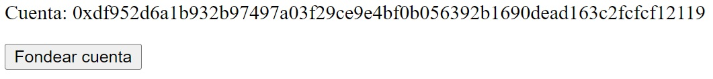
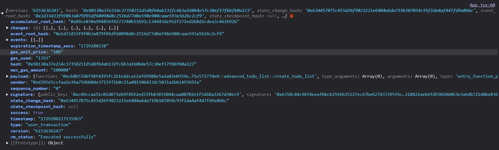

# Funciones de escritura

Una función de escritura en blockchain es una operación que modifica el estado de la cadena de bloques, como actualizar balances o añadir datos a un contrato inteligente. Estas funciones requieren una transacción que debe ser validada y registrada por los nodos de la red, lo que suele conllevar un costo en gas. En contraste, las funciones de vista o lectura no alteran el estado y simplemente consultan información existente en la cadena, sin necesidad de generar una transacción ni pagar gas.

## Ejecutando el tutorial

> :information_source: Recuerda que debes navegar en tu terminal a este directorio:
>```sh
>cd frontend/06_escritura
>```

Para ejecutar el proyecto corre los siguientes comandos en tu terminal:

* Instala las dependencias del proyecto
    ```sh
    npm install
    ```
* Levanta el servidor de desarrollo
    ```sh
    npm run dev
    ```

Después de unos momentos obtendrás algo como esto:
```
  VITE v5.4.9  ready in 102 ms

  ➜  Local:   http://localhost:5173/
  ➜  Network: use --host to expose
  ➜  press h + enter to show help
```

Navega al enlace `http://localhost:5173/` en tu navegador ó simplemente presiona `Ctrl`+`click` en el enlace que se muestra en la terminal.

Al abrir la aplicación deberías de ver algo como esto:



> :information_source: La cuenta que se te generen a tí será diferente a esta.

* Haz click en `Fondear cuenta`.
* Una vez fondeada tu cuenta, haz click en `Crear Lista TODO`.
* Cuando se ejecute la transacción, deberías de ver algo similar a esto en tu consola:



> :information_source: La información de la transacción que se te genere a tí será diferente a esta.

Podemos ver información variada de la transacción. Aunque realmente la mayoría de las cosas no son relevantes para nosotros, es bueno saber cómo se compone un recibo de transacción.

Si quieres ver toda la información que tiene un objeto como estos te la ponemos acá:

<details>
    <summary>Mostrar objeto</summary>
    <pre><code>
    {
        "version": "6153669706",
        "hash": "0xd6844b0a7c267cfed1580acded7220eadd6d12b940b176070cd36de5e0e59bc2",
        "state_change_hash": "0x30329581a5521273756c61f1ec878dd593136d155d1a84a4570369c255799a4d",
        "event_root_hash": "0x1d33d33f9f8b3a879f01df60098d8c2516d77d0a598e980caae593a5626c2cf9",
        "state_checkpoint_hash": null,
        "gas_used": "1393",
        "success": true,
        "vm_status": "Executed successfully",
        "accumulator_root_hash": "0x6016f6d010a95b7b77557b23f72a31b2cffcd690c1ab435680a6e03059c1c739",
        "changes": [
            {
                "address": "0xcd941566cb363e15fc9f6b123c9f5b71c8dda56c92c3a553615a74ad4340a8f9",
                "state_key_hash": "0x3d7c98f2a09255fa21a9ffe7801529ed67b7f89dac3cfa3eebd21527ea99eb32",
                "data": {
                    "type": "0xcb8b57d6f98f4295fc261eddca12af69988e5a2a02e0359e5f2ab71e57277de4::advanced_todo_list::TodoList",
                    "data": {
                        "owner": "0xdf952d6a1b932b97497a03f29ce9e4bf0b056392b1690dead163c2fcfcf12119",
                        "todos": []
                    }
                },
                "type": "write_resource"
            },
            {
                "address": "0xcd941566cb363e15fc9f6b123c9f5b71c8dda56c92c3a553615a74ad4340a8f9",
                "state_key_hash": "0xc6099f547dccb69ebf7ddc986bca47c9d8681fc8a9e9c78cb593651e09b9e5b4",
                "data": {
                    "type": "0x1::object::ObjectCore",
                    "data": {
                        "allow_ungated_transfer": true,
                        "guid_creation_num": "1125899906842625",
                        "owner": "0xdf952d6a1b932b97497a03f29ce9e4bf0b056392b1690dead163c2fcfcf12119",
                        "transfer_events": {
                            "counter": "0",
                            "guid": {
                                "id": {
                                    "addr": "0xcd941566cb363e15fc9f6b123c9f5b71c8dda56c92c3a553615a74ad4340a8f9",
                                    "creation_num": "1125899906842624"
                                }
                            }
                        }
                    }
                },
                "type": "write_resource"
            },
            {
                "address": "0xdf952d6a1b932b97497a03f29ce9e4bf0b056392b1690dead163c2fcfcf12119",
                "state_key_hash": "0x18ff0adc4296fb953019be87df2f84b9163a20745773cc8f1c6d8c8e4ca31700",
                "data": {
                    "type": "0x1::coin::CoinStore<0x1::aptos_coin::AptosCoin>",
                    "data": {
                        "coin": {
                            "value": "99860700"
                        },
                        "deposit_events": {
                            "counter": "1",
                            "guid": {
                                "id": {
                                    "addr": "0xdf952d6a1b932b97497a03f29ce9e4bf0b056392b1690dead163c2fcfcf12119",
                                    "creation_num": "2"
                                }
                            }
                        },
                        "frozen": false,
                        "withdraw_events": {
                            "counter": "0",
                            "guid": {
                                "id": {
                                    "addr": "0xdf952d6a1b932b97497a03f29ce9e4bf0b056392b1690dead163c2fcfcf12119",
                                    "creation_num": "3"
                                }
                            }
                        }
                    }
                },
                "type": "write_resource"
            },
            {
                "address": "0xdf952d6a1b932b97497a03f29ce9e4bf0b056392b1690dead163c2fcfcf12119",
                "state_key_hash": "0x88286e6be126781a1ef4bf235543f5c13c5d284035052f7fbea3779098338b46",
                "data": {
                    "type": "0x1::account::Account",
                    "data": {
                        "authentication_key": "0xdf952d6a1b932b97497a03f29ce9e4bf0b056392b1690dead163c2fcfcf12119",
                        "coin_register_events": {
                            "counter": "1",
                            "guid": {
                                "id": {
                                    "addr": "0xdf952d6a1b932b97497a03f29ce9e4bf0b056392b1690dead163c2fcfcf12119",
                                    "creation_num": "0"
                                }
                            }
                        },
                        "guid_creation_num": "4",
                        "key_rotation_events": {
                            "counter": "0",
                            "guid": {
                                "id": {
                                    "addr": "0xdf952d6a1b932b97497a03f29ce9e4bf0b056392b1690dead163c2fcfcf12119",
                                    "creation_num": "1"
                                }
                            }
                        },
                        "rotation_capability_offer": {
                            "for": {
                                "vec": []
                            }
                        },
                        "sequence_number": "1",
                        "signer_capability_offer": {
                            "for": {
                                "vec": []
                            }
                        }
                    }
                },
                "type": "write_resource"
            },
            {
                "address": "0xdf952d6a1b932b97497a03f29ce9e4bf0b056392b1690dead163c2fcfcf12119",
                "state_key_hash": "0x9c35ada8e7b1765a302b0892659a32059a1c0ff400dd5a3ca5b4b90489caae5b",
                "data": {
                    "type": "0xcb8b57d6f98f4295fc261eddca12af69988e5a2a02e0359e5f2ab71e57277de4::advanced_todo_list::UserTodoListCounter",
                    "data": {
                        "counter": "1"
                    }
                },
                "type": "write_resource"
            },
            {
                "state_key_hash": "0x6e4b28d40f98a106a65163530924c0dcb40c1349d3aa915d108b4d6cfc1ddb19",
                "handle": "0x1b854694ae746cdbd8d44186ca4929b2b337df21d1c74633be19b2710552fdca",
                "key": "0x0619dc29a0aac8fa146714058e8dd6d2d0f3bdf5f6331907bf91f3acd81e6935",
                "value": "0x5c2d3983e974e7940100000000000000",
                "data": null,
                "type": "write_table_item"
            }
        ],
        "sender": "0xdf952d6a1b932b97497a03f29ce9e4bf0b056392b1690dead163c2fcfcf12119",
        "sequence_number": "0",
        "max_gas_amount": "200000",
        "gas_unit_price": "100",
        "expiration_timestamp_secs": "1729280828",
        "payload": {
            "function": "0xcb8b57d6f98f4295fc261eddca12af69988e5a2a02e0359e5f2ab71e57277de4::advanced_todo_list::create_todo_list",
            "type_arguments": [],
            "arguments": [],
            "type": "entry_function_payload"
        },
        "signature": {
            "public_key": "0xfb16a86d118c89390defca59c0063e6fb7db4924c3be6505afc31fd9484c324b",
            "signature": "0xf9d34c64a8116054d6605c9d717b3dd15e393b55566879f45e888d881ae26632c80324d52e82dc38eef709cc19a7192b33b400aba7d02e107764e57a8bf7dd0a",
            "type": "ed25519_signature"
        },
        "events": [
            {
                "guid": {
                    "creation_number": "0",
                    "account_address": "0x0"
                },
                "sequence_number": "0",
                "type": "0x1::transaction_fee::FeeStatement",
                "data": {
                    "execution_gas_units": "5",
                    "io_gas_units": "2",
                    "storage_fee_octas": "138680",
                    "storage_fee_refund_octas": "0",
                    "total_charge_gas_units": "1393"
                }
            }
        ],
        "timestamp": "1729280806909072",
        "type": "user_transaction"
    }
    </code></pre>
</details>

## Tutorial

Puedes encontrar la documentación para este tutorial dentro del archivo `src/App.jsx`. Cada una de las declaraciones tiene un comentario para ayudarte a entender cada uno de los temas tocados.

Este tutorial se basó en el contrato Advanced TODO List hecho por Aptos Labs.

Puedes encontrar el código usando el [Aptos Explorer](https://explorer.aptoslabs.com/object/0xcb8b57d6f98f4295fc261eddca12af69988e5a2a02e0359e5f2ab71e57277de4/modules/code/advanced_todo_list?network=testnet) ó en el [Github oficial](https://github.com/aptos-labs/move-by-examples/tree/main/advanced-todo-list) de Aptos Labs.

## Reto

Puedes experimentar conectando alguna de las otras funciones de escritura dentro del contrato.
