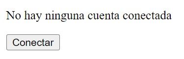
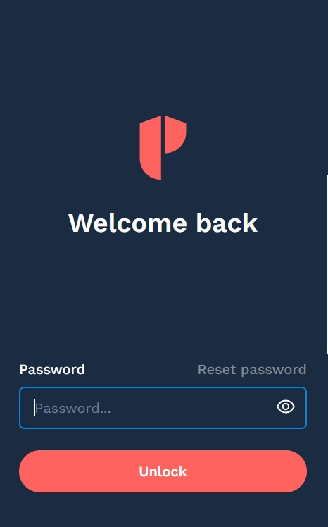
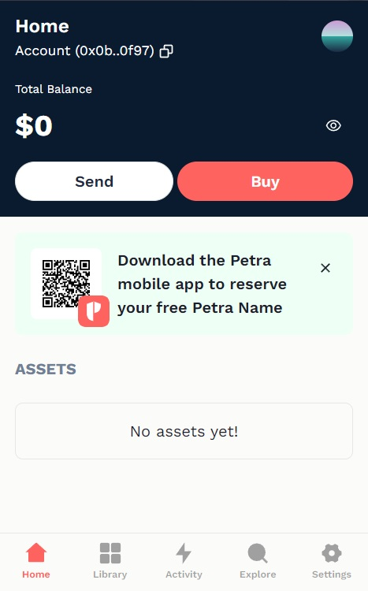
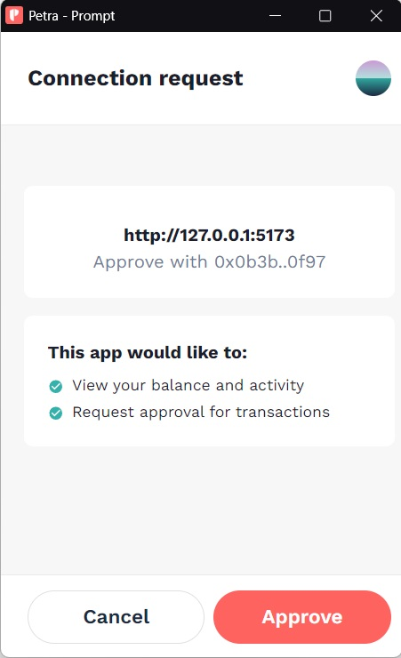

# Billeteras

Una wallet o billetera en blockchain es una herramienta que permite a los usuarios gestionar sus criptomonedas y activos digitales. Funciona almacenando las claves privadas que otorgan acceso a las direcciones en la cadena de bloques, lo que permite realizar transacciones como enviar o recibir fondos. Aunque la wallet no almacena las criptomonedas físicamente (estas siempre residen en la blockchain), es esencial para firmar transacciones y verificar la propiedad de los activos. En Aptos, la wallet más usada es [Petra Wallet](https://petra.app/).

## Ejecutando el tutorial

> :information_source: Recuerda que debes navegar en tu terminal a este directorio:
>```sh
>cd frontend/07_billeteras
>```

Para ejecutar el proyecto corre los siguientes comandos en tu terminal:

* Instala las dependencias del proyecto
    ```sh
    npm install
    ```
* Levanta el servidor de desarrollo
    ```sh
    npm run dev
    ```

Después de unos momentos obtendrás algo como esto:
```
  VITE v5.4.9  ready in 102 ms

  ➜  Local:   http://localhost:5173/
  ➜  Network: use --host to expose
  ➜  press h + enter to show help
```

Navega al enlace `http://localhost:5173/` en tu navegador ó simplemente presiona `Ctrl`+`click` en el enlace que se muestra en la terminal.

Al abrir la aplicación deberías de ver algo como esto:



* Para poder interactuar con este tutorial necesitas haber creado una wallet en la red de Aptos. Si aún no lo haz hecho puedes instalar [Petra Wallet](https://petra.app/) y crear una cuenta.
* Una vez que tengas tu cuenta creada y la extensión de la wallet instalada en tu navegador, haz click en ella e inicia sesión con tu contraseña:
    > :information_source: La **contraseña** es diferente a tu **frase de recuperación**.
    * 
* Deberías de ver una pantalla similar a esta:
    * 
* Los últimos ajustes que tenemos que hacer son:
    * Cambiar la wallet a que interactúe con la red `testnet`. Haz click en **Settings** > **Network** > **Testnet**.
    * Fondear tu cuenta. En el menú Home, haz click en el botón rojo grande que dice **Faucet** un par de veces para agregar fondos a tu cuenta.

Ahora sí, teniendo una wallet funcional y configurada podemos empezar a interactuar con nuestra aplicación.
* Haz click en conectar, deberías ver una ventana emergente como esta:
    
    > :information_source: Cada vez que iniciemos sesión en una app nueva, o queramos interactuar con un método de **escritura** tendremos que aprobar la transacción. Esto es por seguridad, y para que estés seguro que una app se está comportando como debería.
* Aprueba el inicio de sesión y el frontend debería cambiar. Ahora puedes interactuar con los botones `Crear To Do List` y `Tiene To Do List?`.
* Prueba cada uno de los botones, así como el de `Desconectar` para terminar tu sesión en la app.

## Tutorial

Puedes encontrar la documentación para este tutorial dentro del archivo `src/App.jsx`. Cada una de las declaraciones tiene un comentario para ayudarte a entender cada uno de los temas tocados.

### Autenticación en Web2 y Web3

En la era de Web2, la autenticación de usuarios se ha convertido en una pieza fundamental para garantizar la seguridad y privacidad de los datos. A continuación, se describen algunas de las formas más comunes de autenticación en Web2:

1. **Contraseñas**:
    * **Descripción**: La forma más básica de autenticación, donde los usuarios crean y utilizan una contraseña única para acceder a sus cuentas.
    * **Beneficios**: Sencillo de implementar y usar.
    * **Desventajas**: Puede ser vulnerable a ataques como phishing, fuerza bruta y reutilización de contraseñas.

2. **OAuth (Autenticación de Terceros)**:
    * **Descripción**: Permite a los usuarios iniciar sesión en aplicaciones utilizando cuentas de terceros, como Google, Facebook o GitHub.
    * **Beneficios**: Simplifica el proceso de inicio de sesión y reduce la necesidad de recordar múltiples contraseñas.
    * **Desventajas**: Depende de terceros y puede presentar riesgos de privacidad si se comparte demasiada información con la aplicación.

3. **Autenticación de Dos Factores (2FA)**:
    * **Descripción**: Añade una capa adicional de seguridad al requerir una segunda forma de verificación, como un código enviado al móvil del usuario.
    * **Beneficios**: Mejora significativamente la seguridad al requerir algo que el usuario sabe (contraseña) y algo que tiene (dispositivo móvil).
    * **Desventajas**: Puede ser incómodo para los usuarios y depende de la disponibilidad de dispositivos adicionales.

#### Autenticación en Web3

Con la llegada de Web3, la autenticación de usuarios ha evolucionado hacia métodos más descentralizados y seguros, aprovechando la tecnología blockchain. Aquí te ponemos algunas de las formas más destacadas de autenticación en Web3:

1. **Carteras Digitales (Wallets)**:
    * **Descripción**: Los usuarios se autentican utilizando carteras digitales, como MetaMask o Trust Wallet, que almacenan claves criptográficas únicas.
    * **Beneficios**: Proporciona un alto nivel de seguridad al eliminar la necesidad de contraseñas. Los usuarios tienen el control total de sus datos y activos digitales.
    * **Desventajas**: La pérdida de claves privadas puede resultar en la pérdida de acceso a la cuenta y los activos asociados.
2. **Pruebas de Conocimiento Cero (ZKP)**:
    * **Descripción**: Permiten a los usuarios demostrar la veracidad de una afirmación sin revelar la información subyacente.
    * **Beneficios**: Proporciona un alto nivel de privacidad y seguridad. Ideal para casos donde la confidencialidad de los datos es crucial.
    **Desventajas**: Tecnológicamente complejas y aún en desarrollo para muchas aplicaciones.

### Beneficios de la Autenticación Web3 sobre Web2
* **Seguridad Mejorada**:
    * Las carteras digitales y los métodos de autenticación descentralizados eliminan la dependencia de contraseñas, reduciendo significativamente el riesgo de ataques cibernéticos comunes en Web2.
* **Control del Usuario**:
    * En Web3, los usuarios tienen el control total sobre su identidad y datos, eliminando la necesidad de confiar en terceros para la gestión de sus credenciales.
* **Privacidad**:
    * Los métodos de autenticación de Web3, como las pruebas de conocimiento cero, permiten a los usuarios mantener la privacidad de su información personal al tiempo que demuestran la veracidad de sus afirmaciones.
* **Descentralización**:
    * La autenticación en Web3 no depende de una autoridad central, lo que reduce el riesgo de puntos únicos de fallo y hace que el sistema sea más resiliente.

## Reto

Puedes experimentar conectando alguno de los otros métodos de escritura del contrato para que usen la autenticación de la wallet en vez de la cuenta que estabamos creando manualmente.

> :information_source: Recuerda que puedes encontrar el código usando el [Aptos Explorer](https://explorer.aptoslabs.com/object/0xcb8b57d6f98f4295fc261eddca12af69988e5a2a02e0359e5f2ab71e57277de4/modules/code/advanced_todo_list?network=testnet) ó en el [Github oficial](https://github.com/aptos-labs/move-by-examples/tree/main/advanced-todo-list) de Aptos Labs.