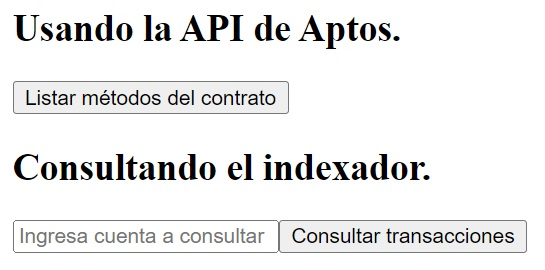

# API

Una API (Interfaz de Programación de Aplicaciones) es un conjunto de reglas y protocolos que permiten la interacción entre diferentes aplicaciones o servicios. En el contexto de blockchain, una API permite a los desarrolladores acceder a los datos de la cadena de bloques o realizar operaciones de forma más eficiente y rápida sin tener que interactuar directamente con la blockchain. Las APIs son útiles para simplificar y agilizar el proceso de consulta y gestión de datos, reduciendo la complejidad técnica.

En Aptos, las funciones de lectura o vista, que no modifican el estado de la blockchain, pueden ejecutarse directamente sobre la red o mediante una API. Aunque consultar la blockchain directamente ofrece seguridad y transparencia, usar una API para estas consultas es mucho más rápido en la mayoría de los casos. Por ejemplo, al usar una API para leer datos de una transacción, puedes obtener la respuesta más rápidamente, lo que mejora la experiencia del usuario, especialmente en aplicaciones que requieren respuestas inmediatas.

## Ejecutando el tutorial

> :information_source: Recuerda que debes navegar en tu terminal a este directorio:
>```sh
>cd frontend/08_api
>```

Para ejecutar el proyecto corre los siguientes comandos en tu terminal:

* Instala las dependencias del proyecto
    ```sh
    npm install
    ```
* Levanta el servidor de desarrollo
    ```sh
    npm run dev
    ```

Después de unos momentos obtendrás algo como esto:
```
  VITE v5.4.9  ready in 102 ms

  ➜  Local:   http://localhost:5173/
  ➜  Network: use --host to expose
  ➜  press h + enter to show help
```

Navega al enlace `http://localhost:5173/` en tu navegador ó simplemente presiona `Ctrl`+`click` en el enlace que se muestra en la terminal.

Al abrir la aplicación deberías de ver algo como esto:



Tenemos 2 botones. Cada uno de ellos interactua con la API de Aptos de manera diferente. Uno consulta información directamente desde la blockchain, y otro interactua con un indexador.

### Usando la API de Aptos

* Haz click en el botón `Listar métodos del contrato`.
* Seguimos trabajando con el contrato `advanced_todo_list`. Lo único que hace esta función es consultar a la API el módulo alojado en cierta dirección, y de la respuesta que obtenemos listamos los métodos que tiene dicho contrato:
    * **complete_todo**
    * **create_todo**
    * **create_todo_list**
    * **get_todo**
    * **get_todo_list**
    * **get_todo_list_by_todo_list_obj_addr**
    * **get_todo_list_counter**
    * **get_todo_list_obj_addr**
    * **has_todo_list**
* Pero esta no es toda la información que obtuvimos de vuelta. Para ver la respuesta completa puedes ver tu consola.
    * > :information_source: Recuerda que puedes abrir la consola presionando `F12` en tu navegador, y haciendo click en la pestaña `Console` ó `Terminal`. También puedes probar con el comando `Ctrl`+`Shift`+`J`.
    * Deberías de ver algo similar a esto:
<details>
    <summary>Mostrar ejemplo de respuesta</summary>
    <pre><code>
    {
        "data": {
            "bytecode": "0xa11ceb0b060000000c01000c020c1a03266d04930106059901900107a9029a0408c306400683074910cc07c9020a950a160cab0a97040dc20e0a000001010102010301040105000607000007080000080800040d0700021407010001022202000009000100000a020100000b030100000c040500000e060100000f070100001008090000110a0a000012020a00001302040000150a0b0000160a020000170a0c000018070100031e070200021f0f020005201112020202012113050100022316170002241819000225021e0108100a1112141d020608010300010503060c03030103010a0203060c03080301060c0305030302080301020503010b040108010101010800050305070801050708000206050a02020a02080303060a020900090101080301060900040800050708010507030307080208050c05080102060c0a0201080501060805010c0306080105060800020608010501060801010801010b0401090012616476616e6365645f746f646f5f6c69737403626373066f626a656374067369676e657206737472696e670c737472696e675f7574696c7304546f646f08546f646f4c6973741355736572546f646f4c697374436f756e7465721a6173736572745f757365725f6861735f676976656e5f746f646f196173736572745f757365725f6861735f746f646f5f6c6973740d636f6d706c6574655f746f646f1f636f6e7374727563745f746f646f5f6c6973745f6f626a6563745f7365656406537472696e670b6372656174655f746f646f106372656174655f746f646f5f6c697374086765745f746f646f0d6765745f746f646f5f6c697374236765745f746f646f5f6c6973745f62795f746f646f5f6c6973745f6f626a5f61646472156765745f746f646f5f6c6973745f636f756e746572064f626a656374116765745f746f646f5f6c6973745f6f626a166765745f746f646f5f6c6973745f6f626a5f616464720d6861735f746f646f5f6c6973740b696e69745f6d6f64756c6507636f6e74656e7409636f6d706c65746564056f776e657205746f646f7307636f756e7465720a616464726573735f6f66156372656174655f6f626a6563745f6164647265737307666f726d61743208746f5f62797465730e436f6e7374727563746f72526566136372656174655f6e616d65645f6f626a6563740f67656e65726174655f7369676e657211616464726573735f746f5f6f626a656374cb8b57d6f98f4295fc261eddca12af69988e5a2a02e0359e5f2ab71e57277de400000000000000000000000000000000000000000000000000000000000000010308030000000000000003080200000000000000030801000000000000000a0206057b7d5f7b7d0520cb8b57d6f98f4295fc261eddca12af69988e5a2a02e0359e5f2ab71e57277de4126170746f733a3a6d657461646174615f7631b4020301000000000000001a455f544f444f5f4c4953545f444f53455f4e4f545f455849535418546f646f206c69737420646f6573206e6f74206578697374020000000000000015455f544f444f5f444f53455f4e4f545f455849535413546f646f20646f6573206e6f74206578697374030000000000000018455f544f444f5f414c52454144595f434f4d504c4554454419546f646f20697320616c726561647920636f6d706c657465640006086765745f746f646f0101000d6765745f746f646f5f6c6973740101000d6861735f746f646f5f6c697374010100156765745f746f646f5f6c6973745f636f756e746572010100166765745f746f646f5f6c6973745f6f626a5f61646472010100236765745f746f646f5f6c6973745f62795f746f646f5f6c6973745f6f626a5f616464720101000002021908031a010102021b051c0a08000202011d0300000000010a0b010b001000410d2304070509070127020100000001070b002901040405060702270202010401010e280b00110e0c040e040b011103110f0c060a0611010b062a010c050a050a020c032e0b0311000b050f000b02430d0c070a071001140921041f05230b0701070027080b070f01150203000000100a07030c010e0107040b0038000c020e02380102040104010114160b00110e0c040e040b011103110f0c060a0611010b062a010c050b020912000c030b050f000b03440d020501040102152f0a00110e0c060a062902040c0a062b021002140c0105120a0006000000000000000012022d020600000000000000000c010b010c020b000b02110311120c040e0411130c050a06400d000000000000000012010c070e050b072d010b062a020c030a03100214060100000000000000160b030f02150206010001011a200b000b01110b0c040a0411010b042b010c030a020a031000410d23041005140b03010701270b0310000b02420d0c050a051003140b051001140207010001011b100b000b01110b0c030a0311010b032b010c020a021004140b021000410d0208010001011c0a0b002b010c010a011004140b011000410d020901000102040d0a00290204090b002b021002140c01050b0600000000000000000c010b01020a00000001050b000b01110b3802020b01000001050e000b011103110f020c01000001050b000b01110b2901020d0000000101020101000102000000010000",
            "abi": {
                "address": "0xcb8b57d6f98f4295fc261eddca12af69988e5a2a02e0359e5f2ab71e57277de4",
                "name": "advanced_todo_list",
                "friends": [],
                "exposed_functions": [
                    {
                        "name": "complete_todo",
                        "visibility": "public",
                        "is_entry": true,
                        "is_view": false,
                        "generic_type_params": [],
                        "params": [
                            "&signer",
                            "u64",
                            "u64"
                        ],
                        "return": []
                    },
                    {
                        "name": "create_todo",
                        "visibility": "public",
                        "is_entry": true,
                        "is_view": false,
                        "generic_type_params": [],
                        "params": [
                            "&signer",
                            "u64",
                            "0x1::string::String"
                        ],
                        "return": []
                    },
                    {
                        "name": "create_todo_list",
                        "visibility": "public",
                        "is_entry": true,
                        "is_view": false,
                        "generic_type_params": [],
                        "params": [
                            "&signer"
                        ],
                        "return": []
                    },
                    {
                        "name": "get_todo",
                        "visibility": "public",
                        "is_entry": false,
                        "is_view": true,
                        "generic_type_params": [],
                        "params": [
                            "address",
                            "u64",
                            "u64"
                        ],
                        "return": [
                            "0x1::string::String",
                            "bool"
                        ]
                    },
                    {
                        "name": "get_todo_list",
                        "visibility": "public",
                        "is_entry": false,
                        "is_view": true,
                        "generic_type_params": [],
                        "params": [
                            "address",
                            "u64"
                        ],
                        "return": [
                            "address",
                            "u64"
                        ]
                    },
                    {
                        "name": "get_todo_list_by_todo_list_obj_addr",
                        "visibility": "public",
                        "is_entry": false,
                        "is_view": true,
                        "generic_type_params": [],
                        "params": [
                            "address"
                        ],
                        "return": [
                            "address",
                            "u64"
                        ]
                    },
                    {
                        "name": "get_todo_list_counter",
                        "visibility": "public",
                        "is_entry": false,
                        "is_view": true,
                        "generic_type_params": [],
                        "params": [
                            "address"
                        ],
                        "return": [
                            "u64"
                        ]
                    },
                    {
                        "name": "get_todo_list_obj_addr",
                        "visibility": "public",
                        "is_entry": false,
                        "is_view": true,
                        "generic_type_params": [],
                        "params": [
                            "address",
                            "u64"
                        ],
                        "return": [
                            "address"
                        ]
                    },
                    {
                        "name": "has_todo_list",
                        "visibility": "public",
                        "is_entry": false,
                        "is_view": true,
                        "generic_type_params": [],
                        "params": [
                            "address",
                            "u64"
                        ],
                        "return": [
                            "bool"
                        ]
                    }
                ],
                "structs": [
                    {
                        "name": "Todo",
                        "is_native": false,
                        "is_event": false,
                        "abilities": [
                            "copy",
                            "drop",
                            "store"
                        ],
                        "generic_type_params": [],
                        "fields": [
                            {
                                "name": "content",
                                "type": "0x1::string::String"
                            },
                            {
                                "name": "completed",
                                "type": "bool"
                            }
                        ]
                    },
                    {
                        "name": "TodoList",
                        "is_native": false,
                        "is_event": false,
                        "abilities": [
                            "key"
                        ],
                        "generic_type_params": [],
                        "fields": [
                            {
                                "name": "owner",
                                "type": "address"
                            },
                            {
                                "name": "todos",
                                "type": "vector<0xcb8b57d6f98f4295fc261eddca12af69988e5a2a02e0359e5f2ab71e57277de4::advanced_todo_list::Todo>"
                            }
                        ]
                    },
                    {
                        "name": "UserTodoListCounter",
                        "is_native": false,
                        "is_event": false,
                        "abilities": [
                            "key"
                        ],
                        "generic_type_params": [],
                        "fields": [
                            {
                                "name": "counter",
                                "type": "u64"
                            }
                        ]
                    }
                ]
            }
        },
        "status": 200,
        "statusText": "",
        "headers": {
            "content-length": "6081",
            "content-type": "application/json; charset=utf-8"
        },
        "config": {
            "transitional": {
                "silentJSONParsing": true,
                "forcedJSONParsing": true,
                "clarifyTimeoutError": false
            },
            "adapter": [
                "xhr",
                "http",
                "fetch"
            ],
            "transformRequest": [
                null
            ],
            "transformResponse": [
                null
            ],
            "timeout": 0,
            "xsrfCookieName": "XSRF-TOKEN",
            "xsrfHeaderName": "X-XSRF-TOKEN",
            "maxContentLength": -1,
            "maxBodyLength": -1,
            "env": {},
            "headers": {
                "Accept": "application/json, text/plain, */*"
            },
            "method": "get",
            "url": "https://api.testnet.aptoslabs.com/v1/accounts/0xcb8b57d6f98f4295fc261eddca12af69988e5a2a02e0359e5f2ab71e57277de4/module/advanced_todo_list"
        },
        "request": {}
    }
    </code></pre>
</details>

### Consultando el indexador

* Ve a tu wallet y copia tu cuenta.
* Pégala en el cuadro de texto en nuestra app que dice `Ingresa cuenta a consultar`
* Haz click en el botón consultar transacciones.

Deberías de obtener una lista con las transacciones más recientes que ha ejecutado tu cuenta. Si has seguido este tutorial deberían de ser alrededor de 7 transacciones.

También, notarás que puedes hacer link en cada una de las transacciones listadas. Hazlo y navegarás al Aptos Explorer, donde puedes ver más detalles de cada una.

De nuevo, en este momento, sólo estamos mostrando el número de la transacción, pero puedes ver en tu consola el resto de la información.

Aquí te dejamos un ejemplo de cómo se vería:

<details>
    <summary>Mostrar ejemplo de respuesta</summary>
    <pre><code>
    {
        "data": {
            "data": {
                "account_transactions": [
                    {
                        "account_address": "0x0b3be25c1755bcef81b6bb39bf26e522e9507db7a2b1c1b7f8bbb59264590f97",
                        "user_transaction": {
                            "block_height": 366324211,
                            "entry_function_id_str": "",
                            "epoch": 18469,
                            "expiration_timestamp_secs": "2024-09-30T22:04:55",
                            "gas_unit_price": 100,
                            "max_gas_amount": 500000,
                            "parent_signature_type": "ed25519_signature",
                            "sender": "0xa39432a064608b1ec3855e28b19c6978239eb7d2639bb8de1c544cd2e8e73226",
                            "sequence_number": 3524431,
                            "timestamp": "2024-09-30T22:04:40.810902",
                            "version": 6065444583
                        },
                        "transaction_version": 6065444583
                    },
                    {
                        "account_address": "0x0b3be25c1755bcef81b6bb39bf26e522e9507db7a2b1c1b7f8bbb59264590f97",
                        "user_transaction": {
                            "block_height": 366324245,
                            "entry_function_id_str": "",
                            "epoch": 18469,
                            "expiration_timestamp_secs": "2024-09-30T22:04:59",
                            "gas_unit_price": 100,
                            "max_gas_amount": 500000,
                            "parent_signature_type": "ed25519_signature",
                            "sender": "0xcba75e0f538f41ee99f6639141bfc6e28f61c8e1cd39419995b641c6babf009b",
                            "sequence_number": 3554838,
                            "timestamp": "2024-09-30T22:04:45.192789",
                            "version": 6065444824
                        },
                        "transaction_version": 6065444824
                    },
                    {
                        "account_address": "0x0b3be25c1755bcef81b6bb39bf26e522e9507db7a2b1c1b7f8bbb59264590f97",
                        "user_transaction": {
                            "block_height": 366324484,
                            "entry_function_id_str": "0xb686acdc6c166f92aa2090f005acc275b258c5d91653df9b3b8af21e7c104773::main::create_aptogotchi",
                            "epoch": 18469,
                            "expiration_timestamp_secs": "2024-09-30T22:06:47",
                            "gas_unit_price": 100,
                            "max_gas_amount": 2270,
                            "parent_signature_type": "ed25519_signature",
                            "sender": "0x0b3be25c1755bcef81b6bb39bf26e522e9507db7a2b1c1b7f8bbb59264590f97",
                            "sequence_number": 0,
                            "timestamp": "2024-09-30T22:05:17.097735",
                            "version": 6065446592
                        },
                        "transaction_version": 6065446592
                    },
                    {
                        "account_address": "0x0b3be25c1755bcef81b6bb39bf26e522e9507db7a2b1c1b7f8bbb59264590f97",
                        "user_transaction": {
                            "block_height": 366325211,
                            "entry_function_id_str": "0xb686acdc6c166f92aa2090f005acc275b258c5d91653df9b3b8af21e7c104773::main::play",
                            "epoch": 18469,
                            "expiration_timestamp_secs": "2024-09-30T22:08:23",
                            "gas_unit_price": 100,
                            "max_gas_amount": 20,
                            "parent_signature_type": "ed25519_signature",
                            "sender": "0x0b3be25c1755bcef81b6bb39bf26e522e9507db7a2b1c1b7f8bbb59264590f97",
                            "sequence_number": 1,
                            "timestamp": "2024-09-30T22:06:54.145612",
                            "version": 6065451901
                        },
                        "transaction_version": 6065451901
                    },
                    {
                        "account_address": "0x0b3be25c1755bcef81b6bb39bf26e522e9507db7a2b1c1b7f8bbb59264590f97",
                        "user_transaction": {
                            "block_height": 366325273,
                            "entry_function_id_str": "0xb686acdc6c166f92aa2090f005acc275b258c5d91653df9b3b8af21e7c104773::main::play",
                            "epoch": 18469,
                            "expiration_timestamp_secs": "2024-09-30T22:08:32",
                            "gas_unit_price": 100,
                            "max_gas_amount": 20,
                            "parent_signature_type": "ed25519_signature",
                            "sender": "0x0b3be25c1755bcef81b6bb39bf26e522e9507db7a2b1c1b7f8bbb59264590f97",
                            "sequence_number": 2,
                            "timestamp": "2024-09-30T22:07:02.891272",
                            "version": 6065452362
                        },
                        "transaction_version": 6065452362
                    },
                    {
                        "account_address": "0x0b3be25c1755bcef81b6bb39bf26e522e9507db7a2b1c1b7f8bbb59264590f97",
                        "user_transaction": {
                            "block_height": 366325329,
                            "entry_function_id_str": "0xb686acdc6c166f92aa2090f005acc275b258c5d91653df9b3b8af21e7c104773::main::play",
                            "epoch": 18469,
                            "expiration_timestamp_secs": "2024-09-30T22:08:40",
                            "gas_unit_price": 100,
                            "max_gas_amount": 20,
                            "parent_signature_type": "ed25519_signature",
                            "sender": "0x0b3be25c1755bcef81b6bb39bf26e522e9507db7a2b1c1b7f8bbb59264590f97",
                            "sequence_number": 3,
                            "timestamp": "2024-09-30T22:07:10.398851",
                            "version": 6065452781
                        },
                        "transaction_version": 6065452781
                    },
                    {
                        "account_address": "0x0b3be25c1755bcef81b6bb39bf26e522e9507db7a2b1c1b7f8bbb59264590f97",
                        "user_transaction": {
                            "block_height": 366325519,
                            "entry_function_id_str": "0xb686acdc6c166f92aa2090f005acc275b258c5d91653df9b3b8af21e7c104773::main::feed",
                            "epoch": 18469,
                            "expiration_timestamp_secs": "2024-09-30T22:09:05",
                            "gas_unit_price": 100,
                            "max_gas_amount": 20,
                            "parent_signature_type": "ed25519_signature",
                            "sender": "0x0b3be25c1755bcef81b6bb39bf26e522e9507db7a2b1c1b7f8bbb59264590f97",
                            "sequence_number": 4,
                            "timestamp": "2024-09-30T22:07:35.9336",
                            "version": 6065454186
                        },
                        "transaction_version": 6065454186
                    },
                    {
                        "account_address": "0x0b3be25c1755bcef81b6bb39bf26e522e9507db7a2b1c1b7f8bbb59264590f97",
                        "user_transaction": {
                            "block_height": 366325580,
                            "entry_function_id_str": "0xb686acdc6c166f92aa2090f005acc275b258c5d91653df9b3b8af21e7c104773::main::feed",
                            "epoch": 18469,
                            "expiration_timestamp_secs": "2024-09-30T22:09:14",
                            "gas_unit_price": 100,
                            "max_gas_amount": 20,
                            "parent_signature_type": "ed25519_signature",
                            "sender": "0x0b3be25c1755bcef81b6bb39bf26e522e9507db7a2b1c1b7f8bbb59264590f97",
                            "sequence_number": 5,
                            "timestamp": "2024-09-30T22:07:44.359898",
                            "version": 6065454635
                        },
                        "transaction_version": 6065454635
                    },
                    {
                        "account_address": "0x0b3be25c1755bcef81b6bb39bf26e522e9507db7a2b1c1b7f8bbb59264590f97",
                        "user_transaction": {
                            "block_height": 366326089,
                            "entry_function_id_str": "0xb686acdc6c166f92aa2090f005acc275b258c5d91653df9b3b8af21e7c104773::main::feed",
                            "epoch": 18469,
                            "expiration_timestamp_secs": "2024-09-30T22:10:23",
                            "gas_unit_price": 100,
                            "max_gas_amount": 20,
                            "parent_signature_type": "ed25519_signature",
                            "sender": "0x0b3be25c1755bcef81b6bb39bf26e522e9507db7a2b1c1b7f8bbb59264590f97",
                            "sequence_number": 6,
                            "timestamp": "2024-09-30T22:08:53.149077",
                            "version": 6065465403
                        },
                        "transaction_version": 6065465403
                    },
                    {
                        "account_address": "0x0b3be25c1755bcef81b6bb39bf26e522e9507db7a2b1c1b7f8bbb59264590f97",
                        "user_transaction": {
                            "block_height": 377530876,
                            "entry_function_id_str": "0x1::aptos_account::transfer_coins",
                            "epoch": 18878,
                            "expiration_timestamp_secs": "2024-10-17T20:52:35",
                            "gas_unit_price": 100,
                            "max_gas_amount": 1998,
                            "parent_signature_type": "ed25519_signature",
                            "sender": "0x0b3be25c1755bcef81b6bb39bf26e522e9507db7a2b1c1b7f8bbb59264590f97",
                            "sequence_number": 7,
                            "timestamp": "2024-10-17T20:51:05.62406",
                            "version": 6148915917
                        },
                        "transaction_version": 6148915917
                    },
                    {
                        "account_address": "0x0b3be25c1755bcef81b6bb39bf26e522e9507db7a2b1c1b7f8bbb59264590f97",
                        "user_transaction": {
                            "block_height": 377531241,
                            "entry_function_id_str": "0x1::aptos_account::transfer_coins",
                            "epoch": 18878,
                            "expiration_timestamp_secs": "2024-10-17T20:53:22",
                            "gas_unit_price": 100,
                            "max_gas_amount": 1998,
                            "parent_signature_type": "ed25519_signature",
                            "sender": "0x0b3be25c1755bcef81b6bb39bf26e522e9507db7a2b1c1b7f8bbb59264590f97",
                            "sequence_number": 8,
                            "timestamp": "2024-10-17T20:51:52.371061",
                            "version": 6148918583
                        },
                        "transaction_version": 6148918583
                    },
                    {
                        "account_address": "0x0b3be25c1755bcef81b6bb39bf26e522e9507db7a2b1c1b7f8bbb59264590f97",
                        "user_transaction": {
                            "block_height": 378183921,
                            "entry_function_id_str": "0xcb8b57d6f98f4295fc261eddca12af69988e5a2a02e0359e5f2ab71e57277de4::advanced_todo_list::create_todo_list",
                            "epoch": 18902,
                            "expiration_timestamp_secs": "2024-10-18T20:17:33",
                            "gas_unit_price": 100,
                            "max_gas_amount": 2786,
                            "parent_signature_type": "ed25519_signature",
                            "sender": "0x0b3be25c1755bcef81b6bb39bf26e522e9507db7a2b1c1b7f8bbb59264590f97",
                            "sequence_number": 9,
                            "timestamp": "2024-10-18T20:16:02.148064",
                            "version": 6153769659
                        },
                        "transaction_version": 6153769659
                    }
                ]
            }
        },
        "status": 200,
        "statusText": "",
        "headers": {
            "cache-control": "private",
            "content-type": "application/json; charset=utf-8"
        },
        "config": {
            "transitional": {
                "silentJSONParsing": true,
                "forcedJSONParsing": true,
                "clarifyTimeoutError": false
            },
            "adapter": [
                "xhr",
                "http",
                "fetch"
            ],
            "transformRequest": [
                null
            ],
            "transformResponse": [
                null
            ],
            "timeout": 0,
            "xsrfCookieName": "XSRF-TOKEN",
            "xsrfHeaderName": "X-XSRF-TOKEN",
            "maxContentLength": -1,
            "maxBodyLength": -1,
            "env": {},
            "headers": {
                "Accept": "application/json, text/plain, */*",
                "Content-Type": "application/json"
            },
            "method": "post",
            "url": "https://api.testnet.aptoslabs.com/v1/graphql",
            "data": "{\"query\":\"query MyQuery {\\n        account_transactions(\\n          where: {account_address: {_eq: \\\"0x0b3be25c1755bcef81b6bb39bf26e522e9507db7a2b1c1b7f8bbb59264590f97\\\"}}\\n        ) {\\n          account_address\\n          user_transaction {\\n            block_height\\n            entry_function_id_str\\n            epoch\\n            expiration_timestamp_secs\\n            gas_unit_price\\n            max_gas_amount\\n            parent_signature_type\\n            sender\\n            sequence_number\\n            timestamp\\n            version\\n          }\\n          transaction_version\\n        }\\n      }\"}"
        },
        "request": {}
    }
    </code></pre>
</details>

> :information_source: La información de las transacciones que se te generen a tí serán diferentes a estas.

## Tutorial

Puedes encontrar la documentación para este tutorial dentro del archivo `src/App.jsx`. Cada una de las declaraciones tiene un comentario para ayudarte a entender cada uno de los temas tocados.

### APIs de Aptos

Se puede acceder a la red Aptos mediante varias API, dependiendo de tu caso de uso.

### Fullnode de Aptos
Esta API, integrada en Fullnodes, proporciona una forma sencilla, de baja latencia y bajo nivel de leer el estado y enviar transacciones a la Blockchain de Aptos. También admite la simulación de transacciones.

Puedes consultarlas acá:

|Red|URL|Referencia|Spec|
|---|---|---|---|
|`mainnet`|[URL](https://api.mainnet.aptoslabs.com/v1)|[Referencia](https://aptos.dev/en/build/apis/fullnode-rest-api-reference?network=mainnet)|[Spec](https://api.mainnet.aptoslabs.com/v1/spec#/)|
|`testnet`|[URL](https://api.testnet.aptoslabs.com/v1)|[Referencia](https://aptos.dev/en/build/apis/fullnode-rest-api-reference?network=testnet)|[Spec](https://api.testnet.aptoslabs.com/v1/spec#/)|
|`devnet`|[URL](https://api.devnet.aptoslabs.com/v1)|[Referencia](https://aptos.dev/en/build/apis/fullnode-rest-api-reference?network=devnet)|[Spec](https://api.devnet.aptoslabs.com/v1/spec#/)|

### Indexadores

Un indexador en blockchain es una herramienta crucial que permite organizar y acceder a la vasta cantidad de datos almacenados en una red blockchain. En lugar de buscar información directamente en cada bloque, lo cual puede ser ineficiente y lento, los indexadores recopilan, filtran y organizan los datos para que puedan ser consultados de manera rápida y precisa. Esto es fundamental para el funcionamiento eficiente de aplicaciones descentralizadas, ya que permite a los desarrolladores y usuarios acceder a información específica sin necesidad de explorar toda la blockchain manualmente.

Por su lado, Aptos ofrece el Aptos Indexer. Esta API permite obtener datos agregados, como la cantidad total de NFTs existentes, datos históricos, como las transacciones realizadas por una cuenta específica, y datos que son difíciles de obtener utilizando la API más simple de Aptos Node, como identificar qué cuenta posee un token con un nombre específico.

Sin indexadores, obtener este tipo de información sería un proceso mucho más complejo y menos eficiente, lo que subraya su valor en el ecosistema blockchain.

Puedes acceder a la API usando los endpoints directamente:
* Mainnet: https://api.mainnet.aptoslabs.com/v1/graphql
* Testnet: https://api.testnet.aptoslabs.com/v1/graphql
* Devnet: https://api.devnet.aptoslabs.com/v1/graphql

O si prefieres una manera más interactiva de usarla, puedes usar una herramienta cómo **Hasura**:

* Mainnet: https://cloud.hasura.io/public/graphiql?endpoint=https://api.mainnet.aptoslabs.com/v1/graphql
* Testnet: https://cloud.hasura.io/public/graphiql?endpoint=https://api.testnet.aptoslabs.com/v1/graphql
* Devnet: https://cloud.hasura.io/public/graphiql?endpoint=https://api.devnet.aptoslabs.com/v1/graphql

## Reto

Intenta ejecutar un método de vista en el contrato `advanced_todo_list` utilizando la API de Aptos. Puedes consultar la referencia de la API para ayudarte.