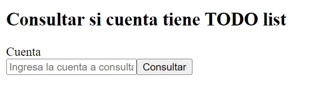

# Errores

El manejo de errores en aplicaciones de React es fundamental para garantizar una buena experiencia de usuario, especialmente cuando se interactúa con APIs o blockchains, como en el ecosistema de Aptos. En estos casos, las conexiones a servidores externos no siempre son predecibles, ya que pueden fallar por problemas de red, sobrecarga del servidor o errores en los datos enviados. En React, el uso de bloques try-catch junto con el estado para gestionar "loading" y "error" proporciona una forma efectiva de capturar y manejar estos fallos sin interrumpir la aplicación, permitiendo mostrar mensajes claros y evitar bloqueos.

Al trabajar con blockchain en Aptos, donde las transacciones y consultas a contratos inteligentes son comunes, este tipo de manejo es aún más crucial. Las interacciones con la blockchain requieren conexiones confiables y, debido a la naturaleza descentralizada, pueden enfrentarse a fallos inesperados. Implementar un manejo adecuado de errores y mostrar retroalimentación al usuario, como "cargando" o detalles de fallos específicos, asegura que los desarrolladores puedan construir aplicaciones robustas que ofrezcan una buena experiencia en el dinámico entorno del desarrollo Web3.

## Ejecutando el tutorial

> :information_source: Recuerda que debes navegar en tu terminal a este directorio:
>```sh
>cd frontend/09_errores
>```

Para ejecutar el proyecto corre los siguientes comandos en tu terminal:

* Instala las dependencias del proyecto
    ```sh
    npm install
    ```
* Levanta el servidor de desarrollo
    ```sh
    npm run dev
    ```

Después de unos momentos obtendrás algo como esto:
```
  VITE v5.4.9  ready in 102 ms

  ➜  Local:   http://localhost:5173/
  ➜  Network: use --host to expose
  ➜  press h + enter to show help
```

Navega al enlace `http://localhost:5173/` en tu navegador ó simplemente presiona `Ctrl`+`click` en el enlace que se muestra en la terminal.

Al abrir la aplicación deberías de ver algo como esto:



* Tenemos un simple formulario para consultar si una cuenta ya interactuó con el contrato `advanced_todo_list`.
* Ingresa una cuenta, puede ser tu propia cuenta desde la wallet Petra.
* Haz click en el botón `Consultar`.
* Notarás que la aplicación cambiará. El formulario se deshabilitará y el botón mostrará el mensaje `Cargando...`
* Ahora intenta ejecutar la app sin ingresar ninguna cuenta en el formulario.
* Notarás que ahora hay una alerta indicando cuando hay un error en nuestra app.

> :information_source: Puedes consultar los errores completos en la consola del navegador.

## Tutorial

Puedes encontrar la documentación para este tutorial dentro del archivo `src/App.jsx`. Cada una de las declaraciones tiene un comentario para ayudarte a entender cada uno de los temas tocados.

## Reto

Intenta mostrar el mensaje de error en algún elemento de React como un `<p>`.