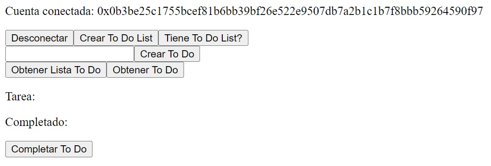

# DApp

Una aplicación descentralizada o dApp es una aplicación que funciona sobre una red blockchain, lo que permite que las transacciones y datos se gestionen de manera segura y sin la necesidad de intermediarios centralizados. En lugar de depender de servidores controlados por una sola entidad, las dApps se ejecutan en redes distribuidas donde el control y la propiedad de los datos están en manos de los usuarios. Esto proporciona mayor transparencia, seguridad y resistencia a la censura. Las dApps permiten casos de uso como contratos inteligentes, intercambios financieros descentralizados, y más.

En el contexto de Aptos, una blockchain de alta velocidad y baja latencia, las dApps son especialmente importantes debido a la infraestructura innovadora de Aptos que permite ejecutar transacciones de manera rápida y eficiente. Con su lenguaje de programación Move y su enfoque en la escalabilidad, Aptos se convierte en una plataforma ideal para el desarrollo de dApps complejas y de alto rendimiento. Esto abre oportunidades para una adopción masiva en áreas como finanzas descentralizadas (DeFi), juegos y NFT, ofreciendo a los desarrolladores herramientas robustas y seguras para construir la próxima generación de aplicaciones descentralizadas.

## Ejecutando el tutorial

> :information_source: Recuerda que debes navegar en tu terminal a este directorio:
>```sh
>cd frontend/10_dapp
>```

Para ejecutar el proyecto corre los siguientes comandos en tu terminal:

* Instala las dependencias del proyecto
    ```sh
    npm install
    ```
* Levanta el servidor de desarrollo
    ```sh
    npm run dev
    ```

Después de unos momentos obtendrás algo como esto:
```
  VITE v5.4.9  ready in 102 ms

  ➜  Local:   http://localhost:5173/
  ➜  Network: use --host to expose
  ➜  press h + enter to show help
```

Navega al enlace `http://localhost:5173/` en tu navegador ó simplemente presiona `Ctrl`+`click` en el enlace que se muestra en la terminal.

Al abrir la aplicación deberías de ver algo como esto:


* Conecta tu wallet.
* Crea una To Do List con el botón `Crear To Do List`. Puedes validar si ya tienes una lista creada usando el botón `Tiene To Do List?`.
* Al crear una lista, deberías de ver algo como esto:

* Crea un To Do añadiendo algún texto en el campo `Ingresa To Do`. Después, haz click en el botón `Crear To Do`.
* Puedes obtener la cantidad de To Do que tienes en una lista usando el botón `Obtener Lista To Do`. Este resultado lo podemos ver en la consola:
    ```json
    [
        "0xb3be25c1755bcef81b6bb39bf26e522e9507db7a2b1c1b7f8bbb59264590f97",
        "3"
    ]
    ```
* Haz click en el botón `Obtener To Do` para llenar los textos vacíos debajo de este botón.
* Por último, puedes completar el To Do haciendo click en `Completar To Do`.

## Tutorial

Todo lo que hicimos acá lo hemos visto antes. Así que sólo analiza el código en `scr/App.jsx` e intenta entender cada una de las líneas de código.

## Reto

El flujo que hicimos aquí es muy básico. Identifica áreas de mejora para nuestra aplicación.