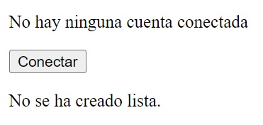

# Estilos

CSS (Cascading Style Sheets) es un lenguaje utilizado para describir la presentación visual de un documento HTML o XML, definiendo cómo los elementos deben ser mostrados en pantalla, en papel o en otros medios. Los estilos en CSS permiten separar el contenido de la presentación, lo que facilita el mantenimiento y la modificación del diseño sin alterar el código de la aplicación. Es crucial usar CSS en aplicaciones web porque mejora la experiencia del usuario al crear interfaces visualmente atractivas, accesibles y consistentes, además de optimizar la eficiencia en la carga y presentación de la página.

## Ejecutando el tutorial

> :information_source: Recuerda que debes navegar en tu terminal a este directorio:
>```sh
>cd frontend/11_estilos
>```

Para ejecutar el proyecto corre los siguientes comandos en tu terminal:

* Instala las dependencias del proyecto
    ```sh
    npm install
    ```
* Levanta el servidor de desarrollo
    ```sh
    npm run dev
    ```

Después de unos momentos obtendrás algo como esto:
```
  VITE v5.4.9  ready in 102 ms

  ➜  Local:   http://localhost:5173/
  ➜  Network: use --host to expose
  ➜  press h + enter to show help
```

Navega al enlace `http://localhost:5173/` en tu navegador ó simplemente presiona `Ctrl`+`click` en el enlace que se muestra en la terminal.

Al abrir la aplicación deberías de ver algo como esto:



* La app funciona exactamente igual a la anterior, el único cambio fue que se le agregaron estilos.
* Puedes experimentar con ellos en el archivo `src/App.css`.

## Tutorial

Todo lo que hicimos acá lo hemos visto antes. Así que sólo analiza el código en `scr/App.jsx` e intenta entender cada una de las líneas de código.

## Reto

Cambia alguno de los colores por alguno que te llame la atención. Puedes usar [ChatGPT](https://chatgpt.com/) para apoyarte en los estilos. Es muy buena para hacer cosas sencillas sin tener que saber teoría de colores o diseño.